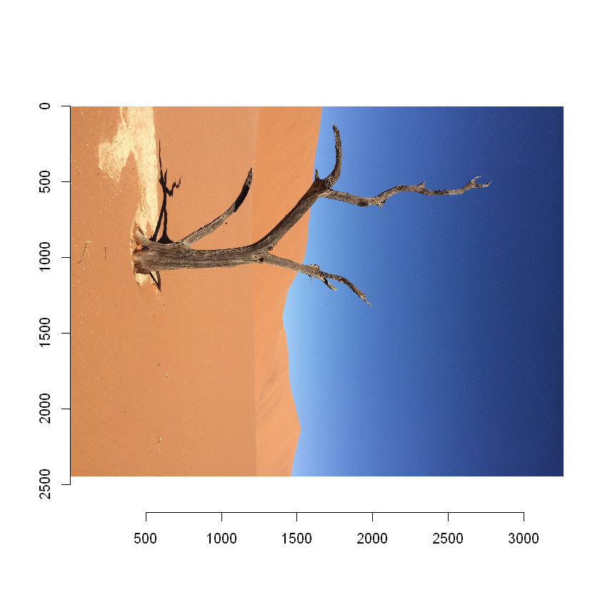
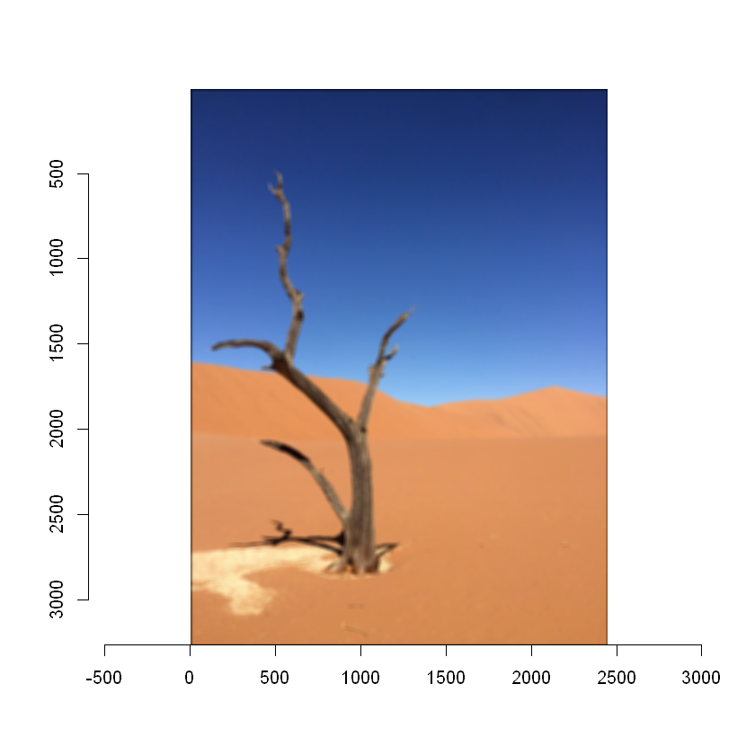

<!-- README.md is generated from README.Rmd. Please edit that file -->

# pictureperrrfect

<!-- badges: start -->

[](https://github.com/UBC-MDS/pictureperrrfect/actions)
[](https://github.com/UBC-MDS/pictureperrrfect/actions)
[](https://codecov.io/gh/UBC-MDS/pictureperrrfect)
<!-- badges: end -->

A fun R utility package to make your pictures perfect! The package
enables users to process, manipulate, and gather data about their
images.

## Installation

You can install the released version of pictureperrrfect using the
following commands from your Rstudio console:

``` r
# install devtools if needed
install.packages("devtools")

# install pictureperrrfect
devtools::install_github("UBC-MDS/pictureperrrfect")
```

## Features

The package pictureperrrfect is an image untility package intended to
manipulate images through a variety of functions. The intention is that
a user with little to no experience can quickly call a function to
alter, compress, or print out statistics for an image. Internally, the
functions make use of matrix operations for quick and efficient
processes.

There are four main functions planned for development and they are
outlined below. Each function can be called on colour images or
greyscale images. Additional functions may be added if time permits.

-   Function 1 filter\_perrrfect: With this function, a user can either
    select a predefined filter or create their own custom filter. The
    image is then passed through the filter and output for the user to
    view.

-   Function 2 get\_property\_perrrfect: The goal of this function is to
    take an image and return statistics related to the different colour
    bands within the image. These statistics include mean and median
    values for each channel.

-   Function 3 compression\_perrrfect: Using a pooling algorithm, this
    function will apply lossy compression to given image. The user will
    be able to specify the type of pooling (max, min, or mean) as well
    as the kernel size.

-   Function 4 rotation\_perrrfect: This final function applies a
    rotation to a given image and outputs the result. A user can
    specifiy the number of degrees they wish the image to be rotated.

Image processing is very popular in the R ecosystem so we are aware that
we are not reinventing the wheel with our package, but we hope to gain a
deeper understanding of the inner workings of an image package.
Specifically, the “imager” library has functions that rotate, flip an
image, or filter which covers 3 of our 4 functions.

## Dependencies

-   R
-   imager
-   magrittr,
-   stats,
-   imager,
-   tidyverse,
-   dplyr,
-   reticulate,
-   abind,
-   devtools,
-   knitr
-   testthat (&gt;= 3.0.0)
-   covr
-   here

## Usage

``` r
library(pictureperrrfect)
library(imager)
```

``` r
# Load the image
namibia <- load.image("img/namibia.jpg")
plot(namibia)
```


``` r
# Rotate the image 90 degrees
rotated_namibia <- rotation_perrrfect(namibia, 1)
plot(rotated_namibia)
```



``` r
compress_namibia <- compression_perrrfect(namibia,
  kernel_size = 10,
  pooling_function = "max"
)

plot(compress_namibia)
```


``` r
filtered_namibia <- filter_perrrfect(namibia,
  filter_type = "blur",
  filter_size = 30, custom_filter = NULL
)

plot(filtered_namibia)
```



``` r
print(get_property_perrrfect(namibia))

#>$width
#>[1] 2448
#>
#>$height
#>[1] 3264
#>
#>$pixels
#>[1] 7990272
#>
#>$R
#>[1] 0.5360028 0.4549020
#>
#>$G
#>[1] 0.4792823 0.5490196
#>
#>$B
#>[1] 0.5216981 0.4627451
```

## Contributors

We welcome and recognize all contributions. You can find our
contribution guidelines [here](.github/CONTRIBUTING.md).

-   Chad Neald: @ChadNeald
-   Debananda Sarkar: @debanandasarkar
-   Dustin Burnham: @dusty736
-   Kangbo Lu: @KangboLu

### Workflow

For this project we will be using the GitHub Flow strategy for
collaboration.

### Credits

This package was created following along to “R packages” Chapter 2: The
Whole Game by Hadley Wickham and Jenny Bryan.
